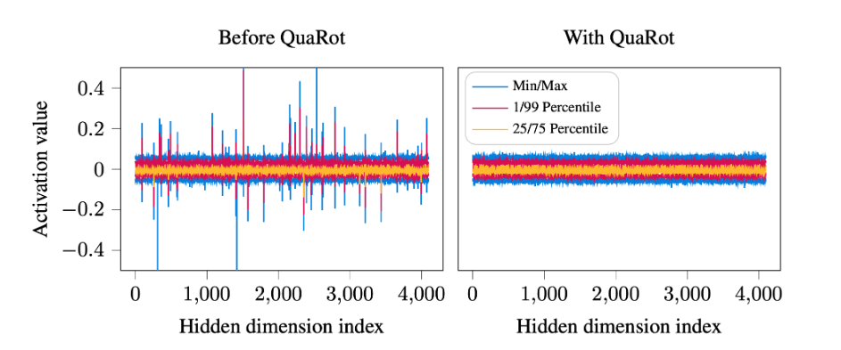
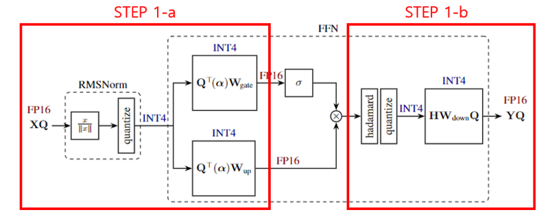
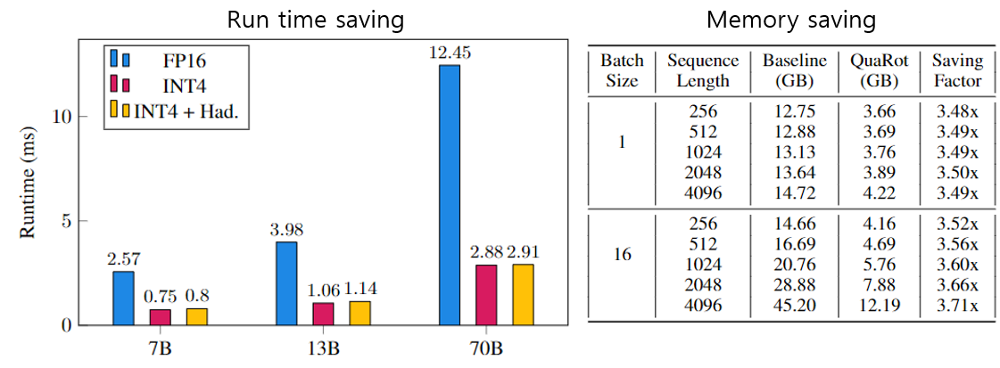

# QuaRot : Outlier-Free 4-Bit Inference in Rotated LLMs

Author : Saleh Ashkboos, Amirkeivan Mohtashami, Maximilian L. Croci, Bo Li

Posted by MyeongJi Yun, JungGyu Min, POSTECH 

This post assumes that the reader has a structural understanding of Transformer and Llama models. If you need a detailed understanding of these models, please refer to the [Transformer](https://arxiv.org/abs/1706.03762), [LLaMa](https://arxiv.org/abs/2302.13971). 

---

Large Language models ( LLMs ) like GPT-2, LLaMa have become increasingly important due to their countless applications. However, their inference requires a significant amount of computation, **memory,** and **energy**. Quantization is among the most important techniques to solve both memory and compute issues in LLM inference. 

---

## Outlier makes quantization difficult

Recent research has shown that LLMs have large outliers and make quantization more difficult, especially in 4-bit case. Also, they mentioned that the activations have more outliers, which makes quantization harder. There are three main streams to solve this problem. 

- Weight only quantization
    - [LLM.int8()](https://arxiv.org/abs/2208.07339): 8-bit Matrix Multiplication for Transformers at Scale, 2022 NeurIPs
    - Weight quantization can ease the memory budget for saving the model. However, since activations are not quantized, the computation still involves integer and float operations, making it difficult to address compute issues.
- Remain outlier in higher bitwidth
    - [QUIK](https://arxiv.org/abs/2310.09259): Towards End-to-End 4-Bit Inference on Generative Large Language Models, 2023
    - Weight quantization can ease the memory budget for saving the model, and since most operations are integer X integer, compute issues are largely resolved. However, some operations still involve integer X float, and the occurrence of float values is irregular, leaving some compute issues unresolved.
- Use calibration set and normalize activation
    - [SmoothQuant](https://arxiv.org/abs/2211.10438): Accurate and Efficient Post-Training Quantization for LLM, 2023 ICML
    - Accuracy is guaranteed up to 8-bit quantization, but it is not assured with 4-bit quantization.
    

In “ QuaRot : Outlier-Free 4-Bit Inference in Rotated LLMs”, the author introduces a new method for quantizing LLM models end-to-end, by utilizing “computational invariance” to all weights and activation and optimizing the computing process. 

---

## Random Hadamard transform doesn’t change the result

In the concept of computational invariance theorem, small changes in input parameters do not cause the output difference if the algorithm is stable.  When applying this to a transformer-based large language model (LLM), it implies that rotating the coordinate system of activations between weight and computation blocks using an orthogonal matrix does not alter the model's output. According to this theory, instead of using any matrix X that constitutes the transformer, you can use *X*′=*UXV* where U and V are orthogonal matrices, and the computational results will remain unchanged.

If the number or proportion of outliers in 𝑋′ is less than that in 𝑋, the information loss during quantization can be reduced. The paper "A" demonstrates that multiplying a matrix by orthogonal matrices on both sides reduces the value of max⁡(𝑋)/mean(𝑋). This means that the presence of extreme values relative to the average is diminished, leading to a more uniform distribution of values within the matrix. However, performing 𝑈𝑋𝑉 also incurs overhead, so selecting orthogonal matrices 𝑈 and 𝑉 that minimize this overhead is essential.

QuaRot uses **Random Hadamard transformation** because the result PPL is lower, so random Hadamard transformation is better than random matrix. 

|  | LLama2-7B | LLama2-7B | LLama2-7B |
| --- | --- | --- | --- |
| QuaRot ( Random ) | 7.45 | 5.84 | 4.07 |
| QuaRot (Hadamard) | 6.10 | 5.40 | 3.79 |

Random Hadamard transformation matrix H is described below : 
display: block  H_{2} = \frac{1}{\sqrt{2}} \begin{bmatrix}
1 & 1 \\
1 & -1 
\end{bmatrix}, \quad H_{2^n} = H_2 \otimes H_{2^{n-1}} 

display: block 
H' = H \cdot \mathrm{diag}(s), \quad s \sim \mathrm{Uniform}(\{-1, +1\})


This transformation pairs elements to perform simultaneous computations, allowing the matrix-vector multiplication between matrix 𝐻 and vector 𝑥 to be executed using only 𝑂(𝑑log⁡𝑑) addition operations without any multiplications, as illustrated below:

---

QuaRot demonstrates that using this technique reduces the number of outliers. By applying the random Hadamard transformation, the distribution of activations is more uniform, which decreases the number of extreme values or outliers, thereby minimizing information loss during quantization.

 

---

## Step by Step modification and quantization

Step 1 involves applying the new schemes proposed by QuaRot to significantly reduce outliers in weights and activations, thereby minimizing accuracy degradation due to quantization held in Step 2. The key technique is to apply the Hadamard transform to each activation and weight in both attention blocks and FFN. This is done by merging operations through the use of two different Hadamard transform matrices across consecutive layers, creating an optimal computational flow.

### Step 1-a. Weight Modification

Note that the multiplication of two orthogonal matrices generates identical matrix, so inserting Q and Q^T between linear layers doesn’t change any output. 

$$
I = Q Q^T, XQQ^TW =  XW
$$

Considering LayerNorm or RMSNorm at the start of the transformer multiplying some orthogonal matrices does not change output. Also, we can fuse the scaling operation of RMSNorm’s : diag(a) into an adjacent weight matrix. 

$$
RMSNorm(X) = x_i \leftarrow \frac{x_i}{||x_i||} = ( \frac{x_i * Q}{||x_i||} ) Q^T = RMSNorm (XQ^T)Q
$$

So for all weights after the RMSNorm layer, the weight becomes : 

$$
W \leftarrow Q^T diag(a) W, Q = Hdiag(s)
$$

### Step 1-b. Rotate FFN

Inserting online Hadamard operation can ease the activation value’s quantization difficulty within each block.  This operation is implicitly reserved by fusing a Hadamard matrix into the next matrix of the network. 

 

---

### Step 1-c. Attention Value Projection

This step applies Hadamard transformations to the value and output projection matrices in the attention block throughout both offline weight modification and online activation transformation. Since value and output projection weight are multiplied in each head, two matrices can be transformed using the Hadamard matrix without changing the result of attention.

$$
W_v^{(h)} \leftarrow W_v^{(h)}H_{d_h}\\W_{out}^{(h)} \leftarrow H_{d_h} W_{out}^{(h)}  
$$

This transformation can be represented with Kronecker multiplication in the point of full attention computation view.

$$
W_v \leftarrow W_v(I\otimes H_{d_h})\\W_{out}\leftarrow (I\otimes H_{d_h}) W_{out}  
$$

The following simple lemma defines the remaining Hadamard operation after modification.

$$
H_{a\times b}= (I\otimes H_{b}) (H_{a}\otimes I )
$$

This defines the remaining Hadamard operation as the later term of the upper lemma, which results in a modification of the online forward path.

$$
Z \leftarrow Z(H_{n_h} \otimes I)
$$

### Step 1-d. Key Rotation

This step applies Hadamard transformation to the key vectors in the attention module. Utilizing the RoPE method (Su et al., 2021), the positional encoding is directly attended to query and key vectors. This reshapes the attention score computation equation into a modification-convenient form. 

$$
\text{Score}=\text{Softmax}(\alpha \text{Pos}(Q_h) \text{Pos}(K_h^T)\odot M)
$$

The Hadamard transformation is applied to both position encoded query and key vectors similar to step 1-c.

$$
\text{Pos}(Q) = \text{Pos}(XW_q)   \leftarrow \text{Pos}(XW_q)(I\otimes H_{d_h})\\\text{Pos}(K) = \text{Pos}(XW_k)   \leftarrow \text{Pos}(XW_k)(I\otimes H_{d_h})  
$$

Note that this transformation can be applied without changing final attention scores since both queries and keys are rotated, therefore no remaining Hadamard transformation exists.

 

---

Step 2 involves applying various state-of-the-art techniques to quantize weights and activations.

### Step 2-a. Weight Quantization

You can quantize the adjusted weights using GPTQ, or you can use a very simple round-to-nearest (RTN) technique. The paper have shown simpler method(RTN) have shown a slight sacrifice in accuracy.

 

### Step 2-b. Online Quantization

To quantize the activations, find the scale factor for each row (max(row) / 7), then divide all values by the scale factor and convert them to the nearest 4-bit integer. For dequantization, multiply the 32-bit integer output of GEMM by the scale factors of both the activation and the weight, and convert the result to FP16.

### Step 2-c. Quantized Attention

The significance of storing in 4-bit is greater than performing calculations in 4-bit because attention operations are memory-bound. Thus, to compute attention, keep the query, key, and value in FP16 and use Flash Attention for the softmax computation.

---

## QuaRot saves runtime & memory

As highlighted in the contributions of the paper, this model demonstrates that it maintains accuracy even with 4-bit quantization, achieving the same level of accuracy as other models with significant computation overhead. Additionally, this paper presents results across various model sizes(7B to 70B) and different tasks(PIQA(PQ), ARC-e(A-e), ARc-c(A-c), HellaSwag(HS), Winogrande(WG), LAMBADA(LA) ), demonstrating that as the model size increases, the quantization error compared to FP16 decreases for all tasks. 

Regarding the Llama-1-7B model's 4-bit quantization situation, which exhibits the largest difference from the FP16 model, we compared it with other recent papers not mentioned in the original study. It is evident that QuaRot, which has lower computational cost, outperforms the generally best-performing QAT and [OmniQuant](https://arxiv.org/pdf/2308.13137), which involves some additional training on top of SmoothQuant, in 4-bit quantization. Despite this low cost, QuaRot has the smallest inference accuracy difference from the FP16 model, making it a highly effective quantization technique. Moreover, while the original SmoothQuant may have lower computational cost at the same bandwidth due to its simplicity, as shown in the table below, its inference accuracy in 4-bit quantization is so poor that it necessitates the use of 8-bit, making comparisons with QuaRot unnecessary.

The key point of QuaRot is that the process of performing the Hadamard transform for quantization to INT4 should not introduce a large overhead compared to the computational benefits gained from converting to INT4. From the perspective of the runtime of the FFN block, it has been confirmed that the overhead remains minimal regardless of layer size, model size, or batch size. Additionally, the memory saving factor ranges from x3.48 to x3.71, which is very close to the ideal value (4 = FP16 / INT4), demonstrating significant efficiency. This paper is particularly noteworthy for addressing the issue of memory overhead in long sequence scenarios by quantizing the KV cache as well.

## Discussion and future work direction

- **Why we limited to symmetric INT4 qunatization?**
    - Numerous papers discuss the limitations of using symmetric quantization in INT4 format for quantization.  For example, [ANT](https://ieeexplore.ieee.org/abstract/document/9923832) demonstrate that, even with the same bitwidth, numeric formats like flint and PoT(power of Two), which divide the representation into exponent and mantissa, can achieve better accuracy due to their ability to represent a wider range of values. In the figure below, the INT-4bit example uses only integers, while the others utilize new data formats. It is evident that the Mean Squared Error (MSE) significantly decreases with these new formats.
        
    -  
        
    - QuaRot considers INT4 format for both weight quantization and activation quantization, likely because modern GPUs support efficient operations with INT4 and INT8 formats. If we could use other formats, it might be possible to maintain accuracy even with formats as small as 3-bit, leading to greater memory savings. However, maintaining computational simplicity is challenging because GPUs are not optimized for operations with custom data types, unlike INT4. Therefore, achieving optimal computation with custom data types would require the development of custom hardware.
 
- **Toward Quantization + Pruning**
    - One of the authors, Dan Alistarh, has papers on [GPTQ](https://arxiv.org/abs/2210.17323) and [OBS](https://proceedings.neurips.cc/paper/1992/file/303ed4c69846ab36c2904d3ba8573050-Paper.pdf). GPTQ focuses on reconstructing matrices after quantization, while OBS deals with reconstructing models after pruning. Both papers share a common foundation in using the Hessian matrix and employ various optimization techniques such as Wood-Fisher. Combining these two approaches, the [OBC](https://arxiv.org/abs/2208.11580) study explores methods to preserve the accuracy of networks that undergo both pruning and quantization.
    - Another paper involving the author demonstrates that SliceGPT similarly achieves effective pruning by employing the concept of computational invariance when multiplying orthogonal matrices. By analyzing the properties of orthogonal matrices in both QuaRot and SliceGPT, I believe it is possible to achieve quantization and pruning simultaneously.

- **How to reduce the overhead of online Hadamard transformation**
    - The forward path in QuaRot mostly follows the activation-quantized LLM tasks like GPTQ, yet requires the additional task of online Hadamard transformation on attention activation. The online Hadamard transformation can be performed by utilizing existing computational resources by converting the task into a matrix-multiplication form, or tossing the task to a dedicated hardware accelerator. Either way have an optimization point of acceleration, where data scheduling of the Hadamard transformation matrix into GEMM task accelerator, or utilizing various previous works about hardware accelerator Hadamard transformation with dedicated dataflow.
